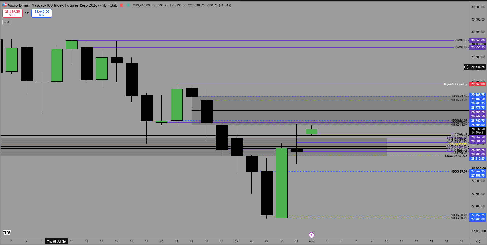
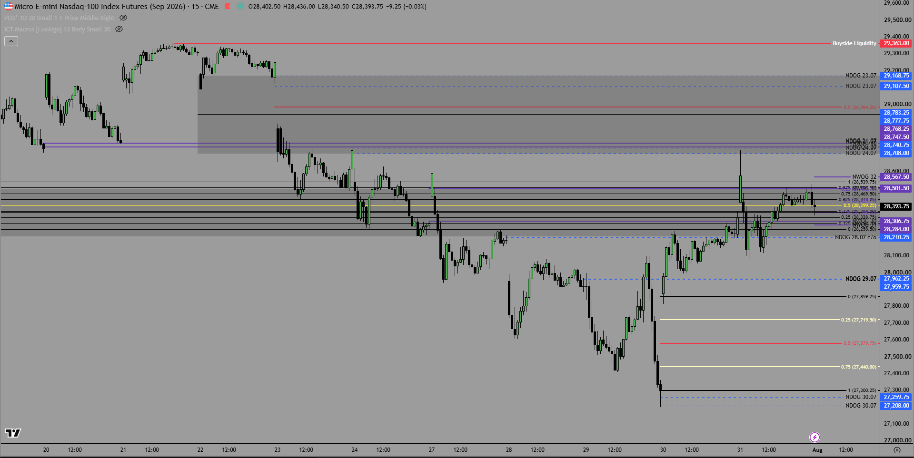

Im Daily Chart ist es am Montag Schwierig und ich achte dort hauptsächlich auf Liqudiditäten im 15min Chart was meinn Bell weather chart ist diesen nutze ich am um oft meinen DOL zu finden. 
Heute um 10Uhr Red Folder News ISM Manufacturing PMI und orange Folder ISM Manufacturing Prices was weniger einflußreich ist.
Im Daily sehr weit im Premium geöffnet mit dem NWOG was also nicht auszuschließen ist das wir dort runter gehen da es stand jetzt auch eine VII ist. relevant ist wie wir closen und am Dienstag öffnen 

Ich sehe eine Buyside bei 28.763.75 die als eventuelles Target fungiert. 
Die Charsbilder siehst du vom Weekly bias 

Ich werde hauptsächlich abwarten was bis zur NY PM SB stunde passiert und mir dan ein ein erneutes bild machen und aufdem 15m chart achten um Liq auszumachen.
Freitags Daily High ist ein möglicher DOL ja doch das Freitags high inkl. das High vom Montag 27.07 halte ich als guten DOL fest aber die Frage ist ob dieses bereits is NY AM genommen wird gerade mit der Volatilität. ICh würde erst einen Drop ins NWOg bevorzugen und dan eine judas swing richtung sellside um dan Bullish weiter zu gehen. 